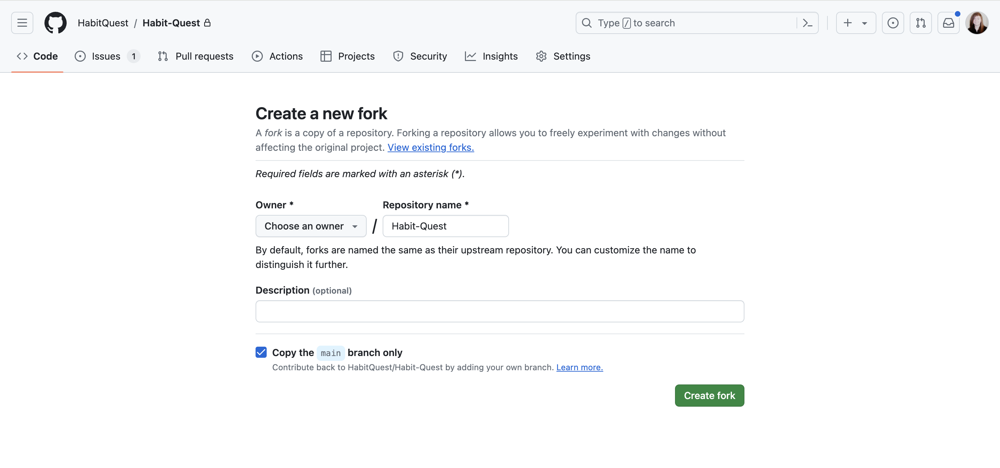

This is a [Next.js](https://nextjs.org/) project bootstrapped with [`create-next-app`](https://github.com/vercel/next.js/tree/canary/packages/create-next-app).

## Getting Started

First, run the development server:

```bash
npm run dev
# or
yarn dev
# or
pnpm dev
# or
bun dev
```

Open [http://localhost:3000](http://localhost:3000) with your browser to see the result.

You can start editing the page by modifying `app/page.js`. The page auto-updates as you edit the file.

This project uses [`next/font`](https://nextjs.org/docs/basic-features/font-optimization) to automatically optimize and load Inter, a custom Google Font.

## Learn More

To learn more about Next.js, take a look at the following resources:

- [Next.js Documentation](https://nextjs.org/docs) - learn about Next.js features and API.
- [Learn Next.js](https://nextjs.org/learn) - an interactive Next.js tutorial.

You can check out [the Next.js GitHub repository](https://github.com/vercel/next.js/) - your feedback and contributions are welcome!

## Deploy on Vercel

The easiest way to deploy your Next.js app is to use the [Vercel Platform](https://vercel.com/new?utm_medium=default-template&filter=next.js&utm_source=create-next-app&utm_campaign=create-next-app-readme) from the creators of Next.js.

Check out our [Next.js deployment documentation](https://nextjs.org/docs/deployment) for more details.

## Contribution Workflow

### Creating Your Fork

In order to contribute to the repository, please fork the Habit-Quest repository.


On the next screen, select your username as Owner, if it is not already preselected. Give the repo an optional description and git "Create Fork".



Hooray! Now you can start contributing to Habit-Quest.

### Keeping your Fork Up-to-Date

As time passes, there will be more and more updates to the main repo. Pulling in these changes to your own repo will be important so you're not duplicating code or working on issues other people have already completed. Simply navigate to your personal fork, and hit the 'sync' button.


### Creating a Pull Request

We are encouraging that all contributors develop code on feature branches, whose names shall be descriptive of the feature being developed.

A typical workflow follows:

```
$ git checkout main
$ git pull main // this ensures that you're working off of the latest code
$ git checkout -b <feature-name> -t
// development work is done
$ git status // will show all of the files with changes
$ git add .
$ git commit -m 'short feature description'
$ git push --set-upstream origin <feature-name>
```

## Viewing Pull Requests On Your Dev Server

Reading code is a great skill to develop, but sometimes you'll want to see how that code in full translates to the page before you approve changes from a pull request. How do you this with our forked repo architecture? First, add a pull request source remote, fetch the changes from that remote repository, and then switch to the development branch.

```
/Habit-Quest $ git remote add pr-source https://github.com/<user-providing-pull-request>/Habit-Quest
/Habit-Quest $ git fetch pr-source
/Habit-Quest $ git switch <branch-to-review>
/Habit-Quest $ npm run dev
```

NOTE: If you just want to see how the build looks, you can view the vercel preview.
